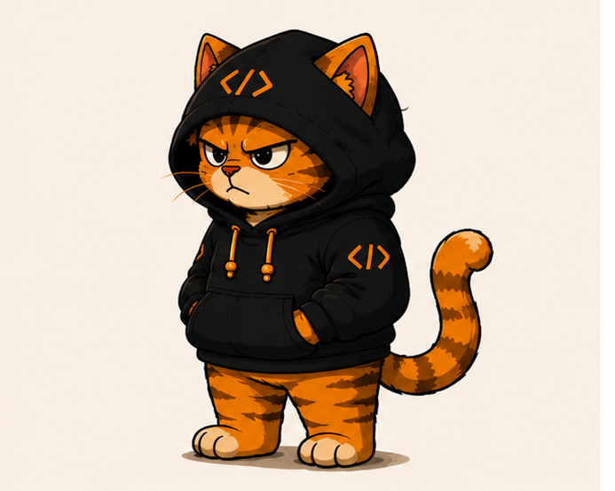
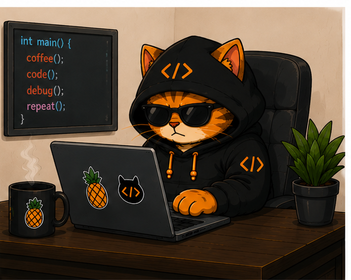
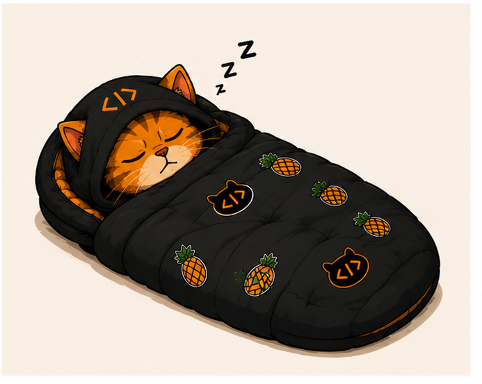

# Byte 

### Grumpy coder. Helpful teacher. Professional bug hater.

<table>
  <tr>
    <td width="24%" align="center">
       
      <b>When the code works first try</b> 
      <i>Suspicious. Check it again.</i>
    </td>
    <td width="52%" align="center">
      <h3>About Byte</h3>
      I build useful web experiences and teach code in a way that is clear, practical, and never boring.  
      Expect honest feedback, clean explanations, and the occasional grumpy stare at a missing bracket.  
      Main fuel: <b>coffee</b>, <b>pineapple</b>, and the hope of getting enough <b>sleep</b>.
    </td>
    <td width="24%" align="center">
       
      <b>After fixing the same bug twice</b> 
      <i>System update postponed until tomorrow.</i>
    </td>
  </tr>
</table>

## What I work with

  

### JavaScript

I use JavaScript to make the web interactive, responsive, and a little less boring.

### TypeScript

Clearer code, safer refactors, and fewer surprises. JavaScript with a seatbelt.

### React

Component-based interfaces that stay organized when the idea grows bigger than one file.

### HTML and CSS

Good structure and intentional design. "Make it pop" is still not a full specification.

### Python

For automation, logic, and making repetitive work somebody else's problem - preferably the computer's.

### Django

A practical toolkit for robust backend applications, with the useful parts already included.

### Supabase

Database, auth, and real-time features without turning every project into a database survival game.

### SQL and PL/pgSQL

For data that is structured, queries that are deliberate, and bugs that have nowhere left to hide.

### Blender

I also build in 3D. Sometimes one tiny detail takes an hour. That is art, apparently.

## Byte's operating system

| Approved | Not approved |
| :--- | :--- |
| Coffee before debugging | Bugs that only happen "sometimes" |
| Pineapple with confidence | "I changed nothing" |
| Sleep whenever it is available | Code with no error message and no explanation |

> **The rule:** ask questions, learn the why, test the fix, and never let a bug feel too comfortable.

<table>
  <tr>
    <td width="50%" align="center">
      <h3>How I teach</h3>
      <b>confused -> explained -> practiced -> understood -> shipped</b>  
      Direct answers. Real examples. No gatekeeping.
    </td>
    <td width="50%" align="center">
       
      <b>Coffee break completed</b> 
      <i>Now hand over the error message.</i>
    </td>
  </tr>
</table>
