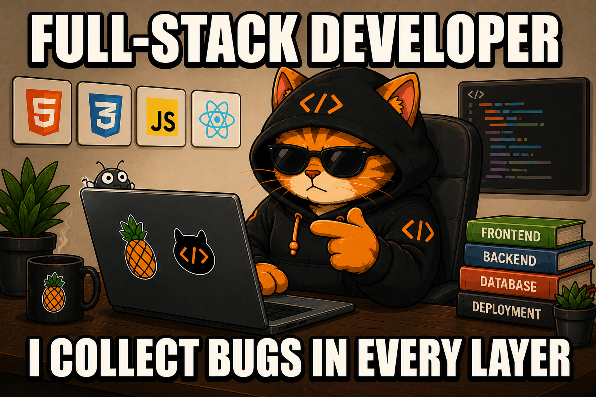
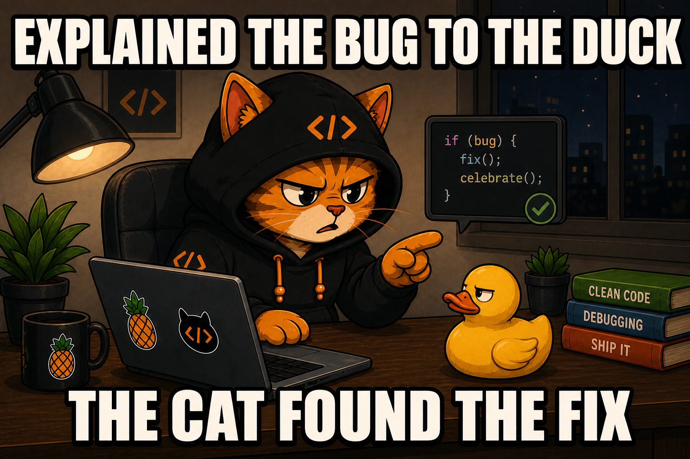
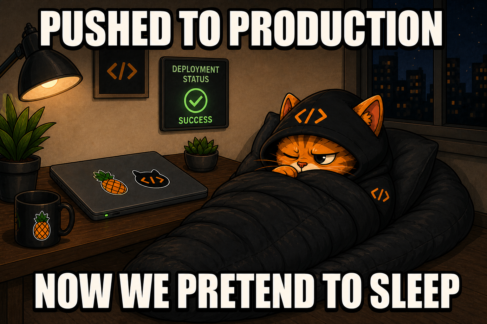

  <h1>Hi, I'm Byte 👋</h1>
  
<b>Developer · Educator · Professional Bug Hater</b>

  
I build useful web experiences, dependable systems, and explanations that make the <i>why</i> behind the code click.

  
  
  
    
  

---

## What I do

- **Build interfaces** that feel clear, fast, and easy to use.
- **Develop backends** that stay dependable after the demo ends.
- **Work with data** without pretending every query was correct on the first try.
- **Teach software** with practical examples, plain language, and zero gatekeeping.

> I like software the way I like coffee: strong, reliable, and nowhere near the keyboard.

## Toolbox

  

 

  

## How I work

| Step | What happens |
| --- | --- |
| **01 · Understand** | Clarify the real problem before touching the code. |
| **02 · Build** | Make the smallest useful change with readable code. |
| **03 · Verify** | Test the behavior, edge cases, and assumptions. |
| **04 · Explain** | Document the reasoning so the next person is not forced to become an archaeologist. |

`confused → explained → practiced → understood → shipped`

No unnecessary complexity, mystery abstractions, or “trust me, it works” deployments.

  

## How I teach

Good teaching should leave people more independent than it found them. I focus on the mental model, show a real example, and make room for questions—especially the ones that start with “but why?”

My preferred lesson plan:

1. Make the idea understandable.
2. Build something small with it.
3. Break it on purpose.
4. Debug it without blaming the framework.
5. Ship it with confidence.

## Working principles

- Clarity beats cleverness.
- Good design makes the next step obvious.
- Tests are cheaper than production surprises.
- Bugs are useful when you take the time to understand them.
- “I changed nothing” is not a debugging strategy.
- Coffee helps. Version control helps more.

  
<b>Meet the rest of the engineering department 🐾</b>

   
  

    
      
    
      
    
  

---

  <h3>Deployment complete. Monitoring has begun.</h3>
  

