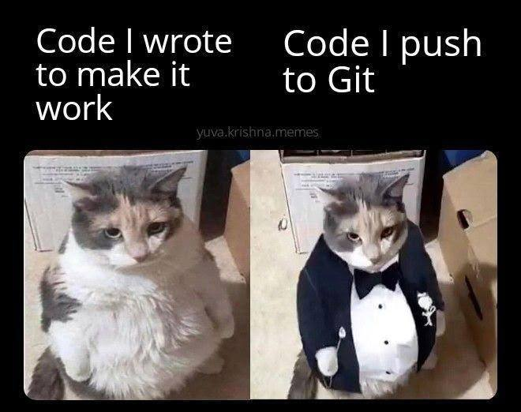
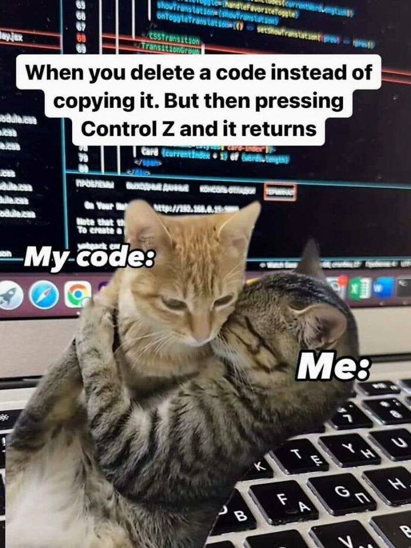
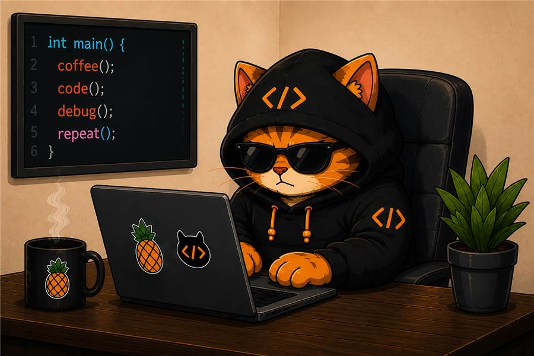

  <h1>Byte</h1>
  
<b>Developer · Educator · Professional Bug Hater</b>

  
Building thoughtful web experiences, dependable systems, and clear explanations that make the <i>why</i behind the code click.

  
  
  
   
  

---

## What I Do

- **Frontend development:** Clear, responsive interfaces designed around real user needs.
- **Backend development:** Dependable systems that continue working after the demo ends.
- **Data work:** Practical database solutions—with no claim that every query is right on the first attempt.
- **Software education:** Clear explanations, useful examples, and zero gatekeeping.

> I like software the way I like coffee: strong, reliable, and nowhere near the keyboard.

## Technical Toolkit

  

  
   
  Meme: <a href="https://programmerhumor.io/git-memes/the-git-glow-up-qjfi">ProgrammerHumor</a>

## Development Approach

| Phase | Focus |
| --- | --- |
| **01 · Understand** | Clarify the real problem before changing the code. |
| **02 · Build** | Implement the smallest useful solution with readable code. |
| **03 · Verify** | Test the behavior, edge cases, and underlying assumptions. |
| **04 · Explain** | Document the reasoning so the next developer does not need to become an archaeologist. |

  <code>confused → explained → practiced → understood → shipped</code>

The goal is straightforward: no unnecessary complexity, mystery abstractions, or “trust me, it works” deployments.

  
   
  Meme: <a href="https://www.boredpanda.com/funny-programming-memes-jokes/">Bored Panda</a>

## Teaching Approach

Good teaching should leave people more independent than it found them. I focus on the underlying mental model, demonstrate it with a real example, and make room for questions—especially the ones that begin with “but why?”

My usual teaching process:

1. Make the idea understandable.
2. Build something small with it.
3. Break it on purpose.
4. Debug it without blaming the framework.
5. Ship it with confidence.

## Working Principles

- Clarity beats cleverness.
- Good design makes the next step obvious.
- Tests are cheaper than production surprises.
- Bugs are useful when you take the time to understand them.
- “I changed nothing” is not a debugging strategy.
- Coffee helps. Version control helps more.

  
<b>Meet the rest of the engineering department 🐾</b>

  

    
     
    
     
    
  

---

  <h3>Deployment complete. Confidence remains suspiciously high.</h3>
  Final meme: <a href="https://medium.com/@devlinktips/ai-vibe-coding-is-killing-junior-dev-careers-or-is-it-e26966e4ae22">BuildShift on Medium</a>
   
  

